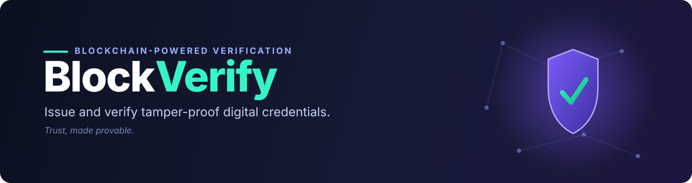

<div align="center">



<br/>

**Trust, made provable.** BlockVerify is a blockchain-backed platform for **issuing, managing, and verifying tamper-proof digital credentials and documents** — with a clean dashboard for issuers and instant, public verification for anyone.

<br/>


[](#-license)

</div>

---

> **Note on scope:** This one-liner describes BlockVerify as a digital-credential verification platform, inferred from the repo (dashboard UI + Supabase backend). Tweak the description and feature list below to match your exact use case.

## ✨ Overview

Paper certificates get forged. PDFs get edited. Screenshots prove nothing. **BlockVerify** fixes that by anchoring each credential to an immutable record, so a document's authenticity can be checked in seconds — no phone calls, no chasing the issuer.

Issuers manage everything from a single **dashboard**: create credentials, track what's been issued, and revoke when needed. Verifiers simply look a record up and get an instant, trustworthy yes-or-no. The frontend is a fast React + Vite single-page app; persistence, auth, and data live in **Supabase**.

---

## 🚀 Features

| Feature | What it does |
| --- | --- |
| 🛡️ **Tamper-Proof Records** | Every credential is anchored so any change is detectable — authenticity is provable, not assumed. |
| 🏷️ **Credential Issuance** | Issuers create and assign verifiable credentials from the dashboard. |
| 🔎 **Instant Verification** | Anyone can verify a credential's validity and origin in seconds. |
| 📊 **Issuer Dashboard** | Central view to manage, search, and track issued credentials. |
| 🔐 **Secure Auth & Access** | Authentication and row-level access control via Supabase. |
| 🗂️ **Revocation & Status** | Mark credentials as active, expired, or revoked. |
| ⚡ **Fast SPA** | Snappy React + Vite frontend with a responsive Tailwind UI. |

---

## 🧰 Tech Stack

This reflects the actual project setup.

**Frontend**
- **React 18** + **TypeScript**
- **Vite** for dev server and builds
- **Tailwind CSS** (+ PostCSS) for styling
- **ESLint** for linting

**Backend & Data**
- **Supabase** — Postgres database, authentication, and row-level security
- Schema managed via SQL migrations in `supabase/migrations`

**Tooling**
- Scaffolded with **Bolt** (`.bolt`)
- Environment-driven config via `.env`

---

## ⚡ Getting Started

### Prerequisites
- **Node.js** 18+ and npm
- A **Supabase** project (free tier works) — grab its URL and anon key
- Git

### Installation

```bash
# 1. Clone the repository
git clone https://github.com/akulaaaaaaaaaaa/blockverify.git
cd blockverify

# 2. Install dependencies
npm install

# 3. Configure environment
cp .env.example .env
# then fill in your Supabase credentials (see below)

# 4. Start the dev server
npm run dev
```

Open **http://localhost:5173** in your browser.

### Environment Variables

Set these in your `.env` file:

```env
VITE_SUPABASE_URL=your-supabase-project-url
VITE_SUPABASE_ANON_KEY=your-supabase-anon-key
```

### Database Setup

Apply the migrations in `supabase/migrations` to your Supabase project — either through the Supabase SQL editor or the CLI:

```bash
# Using the Supabase CLI
supabase link --project-ref <your-project-ref>
supabase db push
```

---

## 📜 Scripts

| Command | Description |
| --- | --- |
| `npm run dev` | Start the Vite dev server |
| `npm run build` | Type-check and build for production |
| `npm run preview` | Preview the production build locally |
| `npm run lint` | Run ESLint across the project |

> If your `package.json` defines different script names, adjust this table to match.

---

## 📁 Project Structure

```
blockverify/
├── .bolt/                  # Bolt scaffolding config
├── src/                    # React + TypeScript source
│   └── ...                 # components, pages (e.g. DashboardHome.tsx), lib
├── supabase/
│   └── migrations/         # SQL migrations for the database schema
├── .env.example            # Template for environment variables
├── index.html              # Vite entry HTML
├── package.json            # Dependencies & scripts
├── tailwind.config.js      # Tailwind configuration
├── postcss.config.js       # PostCSS configuration
├── eslint.config.js        # ESLint configuration
├── tsconfig.json           # TypeScript project references
├── tsconfig.app.json       # App TypeScript config
├── tsconfig.node.json      # Node/tooling TypeScript config
├── vite.config.ts          # Vite configuration
└── README.md
```

---

## 🗺️ Roadmap

- [ ] On-chain anchoring with a public blockchain (e.g. Ethereum / Polygon)
- [ ] Shareable verification links & QR codes
- [ ] Bulk credential issuance (CSV import)
- [ ] Issuer organizations & team roles
- [ ] Public verification API
- [ ] Audit log and analytics

---

## 🤝 Contributing

Contributions are welcome!

1. Fork the project
2. Create your feature branch — `git checkout -b feature/amazing-feature`
3. Commit your changes — `git commit -m "Add amazing feature"`
4. Push to the branch — `git push origin feature/amazing-feature`
5. Open a Pull Request

For anything substantial, please open an issue first so we can align on direction.

---

## 📝 License

Distributed under the **MIT License**. See `LICENSE` for details.

---

<div align="center">

**BlockVerify** · *Trust, made provable.* 🛡️

</div>
